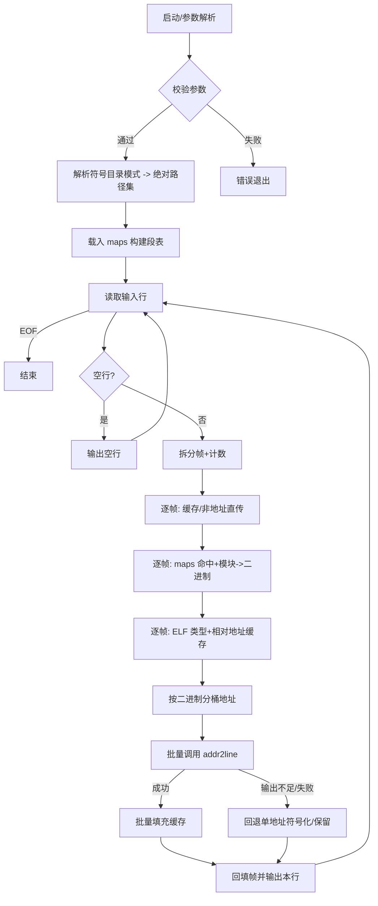

# resolve-stacks.sh 设计说明

## 目的与范围
- 面向 release 环境的火焰图符号化脚本，处理大规模 stackcollapse 文本，保持行序与流式输出。
- 支持 maps 基址恢复、符号目录查找、ELF 类型判断、地址级批处理（默认开启）。

## 整体设计思想
- **流式处理**：逐行读取/输出，避免整文件载入；对空行直接透传换行。
- **分层职责**：参数解析→符号目录解析→maps 载入→行处理→批量符号化→输出。
- **缓存优先**：地址、模块、二进制、ELF 类型、告警均缓存，减少重复 I/O 与外部命令。
- **批量优先**：同一二进制的地址分桶一次调用 addr2line，减少子进程开销；不足时回退单地址解析。
- **健壮性**：对缺符号、缺工具、负偏移、maps 未命中、批量输出不足等场景降级但不中断；输入输出路径相同直接拒绝。
- **可观测性**：`--debug` 输出段表、符号命中、决策、进度与批次计数；警告去重避免刷屏。

## 脚本流程（Mermaid）

## 数据存储结构
- 数组（按 maps 段索引对齐）
  - `MAP_STARTS/ENDS/OFFSETS/PATHS/ADJUSTS`：段起止、偏移、路径、基址调整。
- 关联数组（哈希）
  - `ADDRESS_CACHE`：帧 token → 最终输出（含未解析时的原值）。
  - `ADDRESS_META`：地址解析状态（READY/UNRESOLVABLE）。
  - `ADDRESS_SEGMENT`：地址 → 段索引。
  - `ADDRESS_BINARY`：地址 → 符号二进制路径。
  - `ADDRESS_MODULE`：地址 → maps 模块路径。
  - `ADDRESS_RELHEX`：地址 → 传给 addr2line 的相对/绝对十六进制。
  - `BINARY_CACHE`：模块路径 → 符号二进制（或缺失哨兵）。
  - `MODULE_TYPES`：二进制路径 → ELF 类型（ET_EXEC/ET_DYN/UNKNOWN）。
  - `MODULE_BLOCKED`：模块已判定缺符号，后续跳过。
  - `WARNED_ONCE`：告警去重键集。
- 计数器
  - `LINES_PROCESSED`：已处理行数。
  - `BATCH_CALLS`：已发起的批量 addr2line 调用次数。

## 数据流与决策
1. **输入**：stdin 或文件；maps 文件必需；符号目录模式解析为绝对路径集合。
2. **段命中**：地址十六进制转十进制命中 `MAP_STARTS/ENDS`，获得模块路径与调整值。
3. **符号目录查找**：先目录根平铺按文件名尝试，再按 maps 原始绝对路径做 sysroot 拼接，最后按 basename 递归 `find` 首命中，结果缓存至 `BINARY_CACHE`。
4. **ELF 类型与相对地址**：`detect_elf_type` 缓存类型；ET_EXEC 用运行时地址，ET_DYN/UNKNOWN 用 `addr - adjust`。
5. **批量分桶**：按二进制聚合 `ADDRESS_RELHEX`，一次调用 addr2line 处理多地址。
6. **结果填充**：批量输出按 token 顺序写回 `ADDRESS_CACHE`；输出不足则回退单地址符号化。
7. **行输出**：回填 frames，保持原分隔与计数，逐行输出。

## 健壮性策略
- 输入/输出同路径直接报错退出，避免自覆盖。
- maps 未命中、非文件段、负偏移：告警后保持原地址。
- 符号目录缺失或未命中：去重告警 `missing binary`，保留原地址。
- addr2line 返回 `??`：标记模块阻断，告警一次后跳过后续同模块。
- 批量输出不足/失败：仅 debug 提示，逐地址回退。
- readelf 缺失：降级类型为 UNKNOWN，使用相对地址策略并告警一次。

### 告警去重的陷阱与修正
- 现象：`missing binary` 在调试时对同一路径重复输出。
- 原因：部分路径解析流程在子 shell 中执行（如管道/`mapfile`），`WARNED_ONCE` 关联数组在子 shell 间不共享，导致内存去重失效；且若在入口早期调用 `warn_once` 时未先创建去重文件，会在 `set -e` 下直接退出。
- 修正：脚本启动即创建去重临时文件并注册退出清理，`warn_once` 在主进程与子 shell 均写该文件；同时保留内存哈希，确保同一 key 只告警一次且早期告警不会因文件缺失而终止。

## 可观测性
- `--debug` 输出：
  - 符号目录解析结果。
  - maps 段表。
  - 地址→模块/二进制/相对地址决策。
  - 行进度与批量次数（每 1000 行）。
  - 批量输出不足的降级提示。
- 告警统一 `[WARN]` 前缀，`WARNED_ONCE` 去重。

## 维护与扩展建议
- 批量大小/超时：可引入可选参数限制每次 addr2line 地址数量或设置超时，默认沿用当前批量全收集。
- 缓存上限：大规模输入如需控内存，可新增可选上限或分段刷新策略。
- 兼容性：若遇到非 GNU addr2line 不支持多地址，可自动检测并退化为单地址模式。
- 并发：当前单线程保持行序；如需并发，需加入行序重排与共享缓存保护。
- 观测：可在 debug 模式输出 batch 命中统计（如每个 binary 的地址数）帮助定位热点。
